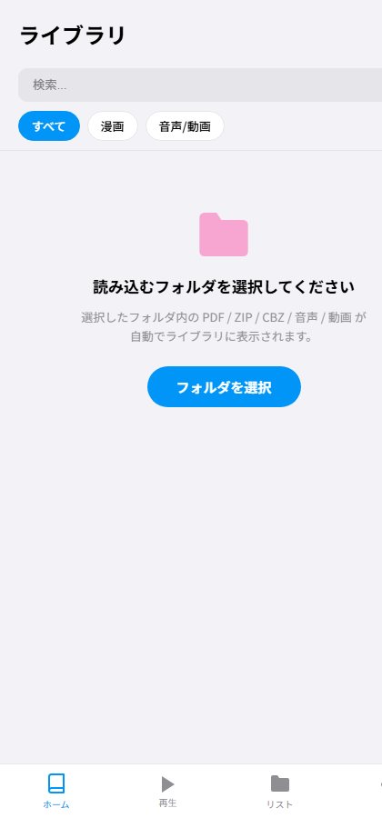

# ONコミ！

端末内のフォルダを直接読み込む、完全オフラインの漫画・音声・動画ライブラリアプリです。
[MedjedBuilder -メジェドビルダー-](https://github.com/Xenoah/html2apk) でそのまま **Android アプリ (APK)** にできます。
ファイルのアップロードは一切行わず、データはすべて端末内で完結します。

## スクリーンショット

| ライト | ダーク |
|:---:|:---:|
|  |  |

## 使い方

1. 初回起動時に「フォルダを選択」で、本や音声・動画を入れたフォルダを選ぶ
2. フォルダ内(サブフォルダ4階層まで)の PDF / ZIP / CBZ / 音声 / 動画 が自動でライブラリに並ぶ
3. サムネイルをタップして閲覧・再生。ファイルの追加・削除はフォルダに直接行い、右上の🔄で再スキャン

| 種類 | 対応形式 |
|---|---|
| 漫画・本 | `.pdf` `.zip` `.cbz`（画像入りアーカイブ） |
| 音声アルバム | `.zip`（音声/動画入りアーカイブ。中身で自動判別） |
| 単体メディア | `.mp3` `.wav` `.ogg` `.m4a` `.flac` `.aac` `.mp4` `.webm` `.m4v` |

## Android アプリ化 (MedjedBuilder)

このリポジトリは MedjedBuilder のプロジェクトとしてそのままビルドできます。

1. [MedjedBuilder のリリース](https://github.com/Xenoah/html2apk/releases) から `MedjedBuilder-Windows-x64.zip` をダウンロード
2. `MedjedBuilder.exe` →「プロジェクトを開く」→ 同梱の **`media-library.h2aproj`** を読み込む
3. 「APKをビルド」

重要な設定は **ストレージモード =「選択フォルダ (SAF)」/ ファイルAPI = ON** の2つです。
詳細な手順・設定表は [BUILD_APK.md](BUILD_APK.md) を参照してください。

## PC ブラウザでの実行

Chrome / Edge (File System Access API 対応ブラウザ) でも動作します。

```bash
git clone https://github.com/SakiikaVR/media-library.git
cd media-library
python -m http.server 8000
# → http://localhost:8000 を開き「フォルダを選択」
```

ライブラリはすべて `lib/` にローカル同梱しているため、オフラインでも動作します。

## 主な機能

### ライブラリ
- フォルダ自動スキャン（サブフォルダ対応）、再スキャン
- ZIP 内 `ComicInfo.xml` からタイトル・作者を自動読み取り
- サムネイル自動生成、表紙の変更（画像アップロード / ページから選択）
- タイトル・作者の編集（アプリ内メタデータのみ。元ファイルは変更しません）
- ひらがな→ローマ字の曖昧検索、種別フィルタ、R-18 タグと表示切り替え
- 長押しで複数選択（一括編集 / リスト追加 / ファイル削除）、カスタムリスト

### 漫画ビューアー
- **ランダムアクセス読み込み**: ZIP の目次と表示ページ（前後2ページ先読み）だけを読むため、
  数百MB のアーカイブでも一瞬で開き、メモリ使用量は一定
- PDF は初回のみ画像に変換してキャッシュ（進捗表示あり）、以後は即表示
- スワイプ / 縦スクロール、右綴じ・左綴じ、見開き表示、ピンチズーム
- シークバー、しおり、前回の続きから再開

### 音声 / 動画
- ZIP アルバム内のフォルダ階層をそのままブラウズ
- 再生 / シーク / 前後トラック、リピート（OFF / 全曲 / 1曲）、シャッフル
- 動画のフルスクリーン再生、ZIP 内の画像・テキスト（UTF-8 / Shift_JIS 自動判定）閲覧

### その他
- ダークモード、アクセントカラー、サムネイルサイズ
- キャッシュ使用量の表示・削除、接続診断

## 技術スタック / 使用ライブラリ

Vanilla JS + Alpine.js の SPA（ビルド不要・静的ファイルのみ）。
以下のオープンソースライブラリを `lib/` に同梱しています。

| ライブラリ | 用途 | ライセンス |
|---|---|---|
| [Alpine.js](https://alpinejs.dev/) + [@alpinejs/intersect](https://alpinejs.dev/plugins/intersect) | UI リアクティビティ / 遅延サムネイル読み込み | MIT |
| [Dexie.js](https://dexie.org/) | IndexedDB ラッパー（キャッシュ保存） | Apache-2.0 |
| [zip.js](https://gildas-lormeau.github.io/zip.js/) | ZIP のランダムアクセス読み込み（Shift_JIS ファイル名対応） | BSD-3-Clause |
| [Lodash](https://lodash.com/) | ユーティリティ | MIT |
| [Howler.js](https://howlerjs.com/) | 音声再生 | MIT |
| [PDF.js](https://mozilla.github.io/pdf.js/) | PDF のページ画像変換 | Apache-2.0 |
| [Swiper](https://swiperjs.com/) | 漫画ビューアーのスワイプ / ズーム | MIT |
| [Feather Icons](https://feathericons.com/) | インライン SVG アイコン | MIT |

詳細な著作権表記はアプリ内の「設定 → オープンソースライセンス」([credit.html](credit.html)) を参照してください。

## ファイル構成

```
├── index.html              # マークアップ
├── css/style.css           # スタイル
├── js/app.js               # アプリケーションロジック
├── lib/                    # 同梱ライブラリ (オフライン動作用)
├── credit.html             # サードパーティライセンス表記
├── media-library.h2aproj   # MedjedBuilder プロジェクトファイル
├── BUILD_APK.md            # APK ビルド手順
├── LICENSE                 # 本体ライセンス (MIT)
└── README.md
```

## プライバシー

読み込んだファイルは選択したフォルダから直接読み取り、外部への送信はありません。
アプリが保存するのはサムネイル・PDF 変換結果などのキャッシュ（IndexedDB）と設定のみです。

## ライセンス

[MIT License](LICENSE)
