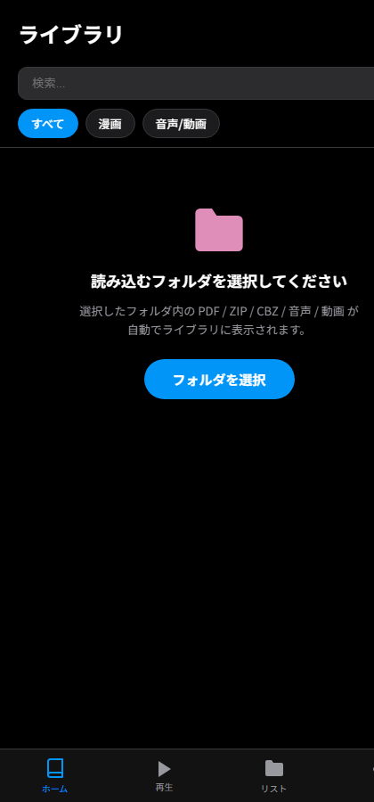

# オンコミ

<p align="center"></p>

<p align="center">
  <a href="https://github.com/SakiikaVR/ON-Comi/releases/latest">
    
  </a>
  <a href="LICENSE">
    
  </a>
</p>


ブラウザだけで動く、完全オフライン保存型の漫画・音声・動画ライブラリアプリです。
すべてのデータは端末内（IndexedDB / localStorage）に保存され、サーバーへのアップロードは一切行いません。
ライブラリもすべてローカル同梱のため、初回表示からインターネット接続不要で動作します。

## スクリーンショット

<p align="center"></p>


## 機能

### ライブラリ管理
- **フォルダ自動ライブラリ（Android アプリ版）**: 端末のフォルダを 1 つ選ぶだけで、中の ZIP / CBZ / PDF / 音声 / 動画がすべて自動でライブラリに表示。ZIP の中身から漫画 / 音声アルバムを自動判別し、サムネイル・タイトル・作者（ComicInfo.xml）も自動取得
- ZIP / CBZ / PDF（漫画）、音声・動画ファイル / ZIP アルバムのインポート（ブラウザ版）
- PDF は取り込み時に自動でページ画像（ZIP）へ変換して高速表示
- ZIP 内の `ComicInfo.xml` からタイトル・作者を自動読み取り（保存時の書き戻しにも対応）
- サムネイル自動生成、表紙の変更（画像アップロード / ページから選択）
- タイトル・作者の編集、複数選択での一括編集
- タイトル・作者での検索（ひらがな→ローマ字変換による曖昧検索対応）
- 種別フィルタ（すべて / 漫画 / 音声・動画）
- 成人向け (R-18) タグと表示切り替え
- 長押し / 右クリックによる複数選択、まとめて削除・リスト追加
- お気に入りリスト（表紙コラージュ付き）の作成・改名・管理

### 漫画ビューアー
- スワイプ / 縦スクロール切り替え
- 右→左（右綴じ）・左→右（左綴じ）の読み方向切り替え
- 見開き 2 ページ表示（横画面向け）
- ピンチズーム、シークバーによるページジャンプ
- しおり（ブックマーク）の追加・一覧・ジャンプ
- 前回の続きから再開

### 音声 / 動画プレイヤー
- ZIP アルバム内のフォルダ階層をそのままブラウズ
- 音声再生（再生 / 一時停止 / 前後トラック / シーク）、mp3 / wav / ogg / m4a / flac / aac / opus 対応
- リピート（OFF / 全曲 / 1曲）、シャッフル
- ロック画面・通知からの再生操作（Media Session API）
- 動画のフルスクリーン再生
- ZIP 内の画像・テキストファイル（UTF-8 / Shift_JIS 自動判定）の閲覧

### その他
- iOS 風デザイン（ダーク / ライトテーマ切り替え）
- アクセントカラー変更（ブルー / ピンク / レッド / オレンジ）
- サムネイルサイズ変更（小 / 中 / 大）
- ストレージ使用量の表示、全データ削除

## インストール（Android）

**[📦 最新リリース](https://github.com/SakiikaVR/ON-Comi/releases/latest)** から `ONComi-x.x.x.apk` を端末に保存し、タップしてインストールしてください
（「提供元不明のアプリ」の許可が必要な場合があります）。
起動後にホームの「フォルダを選択」で漫画・音声を入れたフォルダを選ぶだけで使えます。

> v2.1.0 からビルドを [さきいかビルダー](https://github.com/SakiikaVR/Sakiika-Builder) に移行しました。
> パッケージ名が変わったため、旧 (MedjedBuilder 版) APK とは別アプリとしてインストールされます。

## 使い方（ブラウザ）

リポジトリを clone して任意の HTTP サーバーで配信してください。

```bash
git clone https://github.com/SakiikaVR/ON-Comi.git
cd ON-Comi
# 例: Python の簡易サーバー
python -m http.server 8000
# → http://localhost:8000 を開く
```

## Android アプリとしてビルド（さきいかビルダー）

このリポジトリは [さきいかビルダー](https://github.com/SakiikaVR/Sakiika-Builder) の CLI と
同梱の [sakiika.json](sakiika.json) でそのまま署名済み APK にビルドできます。
ライブラリはすべて `lib/` に同梱済みのため、**インターネット権限は不要**です。

```powershell
# web ファイルをステージング (www/ は .gitignore 済み)
New-Item -ItemType Directory -Force www\css, www\js, www\lib, www\assets | Out-Null
Copy-Item index.html, credit.html www\
Copy-Item css\* www\css\; Copy-Item js\* www\js\; Copy-Item lib\* www\lib\
Copy-Item assets\icon.png www\assets\

sakiika build .\sakiika.json
```

主な設定（sakiika.json に設定済み）:

| 設定 | 値 | 意味 |
|---|---|---|
| `fileAccess` | `folder_pick` | ユーザーが選んだフォルダ（SAF）— **フォルダ自動ライブラリに必須** |
| `permissions` | なし | 通信・カメラ等は一切使いません |
| `bridge.enableReflection` | `true` | ZIP のランダムアクセス読み出しのフォールバックに使用 |
| `webview.htmlFileInput` | `true` | ブラウザ版と同じファイル取り込みにも対応 |

フォルダアクセス・ZIP のランダムアクセス読み出し・content URI 再生は、`app.js` が
さきいかビルダーのブリッジ (`Android.fs` / `Android.reflect`) をネイティブに使用します。
ブラウザで開いたときはブリッジを使わない従来のインポート方式で動作します。

詳細な手順は [BUILD_APK.md](BUILD_APK.md) を参照してください。

> 署名鍵 `sakiika-key.pem` は出力フォルダーに作られます。**Android は同じ証明書でないと上書き更新を
> 受け付けないため、この鍵は必ず保管してください**（このリポジトリには含めていません）。

アプリ起動後にホームの「フォルダを選択」から漫画・音声を入れたフォルダを選ぶと、以後は起動のたびに自動でスキャンされます。

## 技術スタック / 使用ライブラリ

本体は Vanilla JS + Alpine.js の SPA（ビルド不要・静的ファイルのみ）です。
以下のオープンソースライブラリを `lib/` に同梱しています。

| ライブラリ | 用途 | ライセンス |
|---|---|---|
| [Alpine.js](https://alpinejs.dev/) + [@alpinejs/intersect](https://alpinejs.dev/plugins/intersect) | UI リアクティビティ / 遅延サムネイル読み込み | MIT |
| [Dexie.js](https://dexie.org/) | IndexedDB ラッパー（ファイル保存） | Apache-2.0 |
| [zip.js](https://gildas-lormeau.github.io/zip.js/) | ZIP の読み書き（Shift_JIS ファイル名対応） | BSD-3-Clause |
| [Lodash](https://lodash.com/) | ユーティリティ | MIT |
| [Howler.js](https://howlerjs.com/) | 音声再生 | MIT |
| [PDF.js](https://mozilla.github.io/pdf.js/) | PDF のページ画像変換 | Apache-2.0 |
| [Swiper](https://swiperjs.com/) | 漫画ビューアーのスワイプ / ズーム | MIT |
| [Feather Icons](https://feathericons.com/) | インライン SVG アイコン | MIT |

詳細な著作権表記はアプリ内の「設定 → オープンソースライセンス」([credit.html](credit.html)) を参照してください。

## ファイル構成

```
├── index.html       # マークアップ
├── css/style.css    # スタイル
├── js/app.js        # アプリケーションロジック
├── lib/             # 同梱ライブラリ（オフライン動作用）
├── assets/icon.png  # アプリアイコン
├── credit.html      # サードパーティライセンス表記
├── sakiika.json     # さきいかビルダーのビルド設定 (Android 版)
├── LICENSE          # 本体ライセンス (MIT)
└── README.md
```

## プライバシー

インポートしたファイルはすべてブラウザ（または WebView）の IndexedDB / localStorage にのみ保存されます。外部サーバーへの送信はありません。ブラウザのサイトデータを削除するとライブラリも消去されるので注意してください。

## ライセンス

[MIT License](LICENSE)
